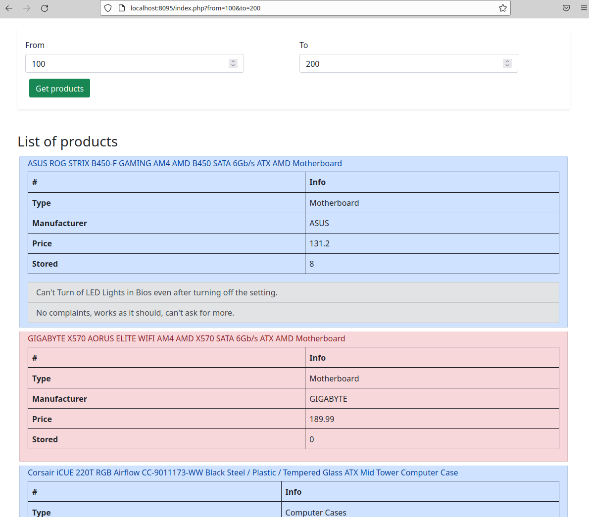

## Лабораторная работа №2

---

Создать и заполнить БД товаров интернет–магазина (в одной коллекции). Для товара обязательно указывается название, цена товара, количество единиц на складе. Возможные поля - фирма-производитель, категория товара (процессоры, материнские платы и т.д.), отзывы (могут быть и более одного), состояние (новое или б/у) и т.д.

Предоставить пользователю возможность получения следующей информации:

    Перечень производителей, с которыми работает магазин;
    Товары, отсутствующие на складе (т.е. вообще они есть, но сейчас количество 0);
    Товары в выбранном ценовом диапазоне.

---

### Результаты

Стартовая страница

Перечень производителей, с которыми работает магазин

Товары, отсутствующие на складе (т.е. вообще они есть, но сейчас количество 0);

Товары в выбранном ценовом диапазоне.

